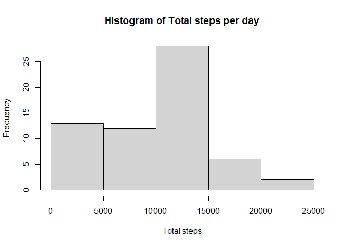
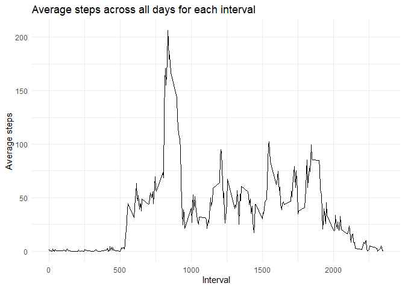
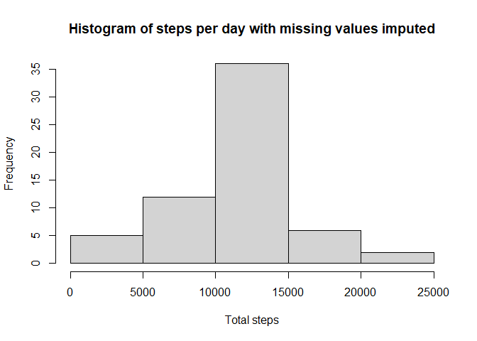
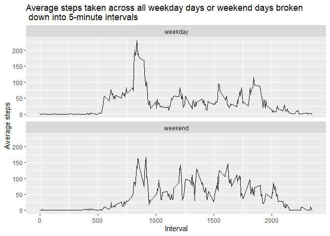

## Loading and preprocessing the data

``` r
### Load required packages
library(dplyr)
```

```
## 
## Attaching package: 'dplyr'
```

```
## The following objects are masked from 'package:stats':
## 
##     filter, lag
```

```
## The following objects are masked from 'package:base':
## 
##     intersect, setdiff, setequal, union
```

``` r
library(lubridate)
```

```
## 
## Attaching package: 'lubridate'
```

```
## The following objects are masked from 'package:base':
## 
##     date, intersect, setdiff, union
```

``` r
library(ggplot2)
```

1) Load the data

``` r
activity <- read.csv("./activity/activity.csv")
```

2) Process/transform the data (if necessary) into a format suitable for 
your analysis. 

``` r
### Convert the interval column to a date
activity$date <- as.Date(activity$date)
```


## What is mean total number of steps taken per day?

1) Calculate the total number of steps taken per day

``` r
steps_per_day <- activity %>%
  group_by(date) %>%
  summarise(
    total_steps = sum(steps, na.rm = TRUE)
  )
```

2) Make a histogram of the total number of steps taken each day

``` r
hist(steps_per_day$total_steps,
     xlab = "Total steps",
     main = "Histogram of Total steps per day")
```

<!-- -->

3) Calculate and report the mean and median of the total number of steps taken per day

``` r
### Calculate the mean of the total steps across all the days
mean_steps <- mean(steps_per_day$total_steps)
mean_steps
```

```
## [1] 9354.23
```

``` r
### Calculate the median of the total steps across all the days
median_steps <- median(steps_per_day$total_steps)
median_steps
```

```
## [1] 10395
```


## What is the average daily activity pattern?

``` r
### Calculate the average steps per interval for each day
steps_interval_avg <- activity %>%
  group_by(interval) %>%
  summarise(
    average_steps = mean(steps, na.rm = TRUE)
  )
```

1) Make a time series plot of the average number of steps taken for each interval across all the days using ggplot

``` r
ggplot(steps_interval_avg, aes(x = interval, y = average_steps)) + 
  geom_line() +
  labs(x = "Interval",
       y = "Average steps",
       title = "Average steps across all days for each interval") +
  theme_minimal()
```

<!-- -->

2) Which 5-minute interval, on average across all the days in the dataset, 
contains the maximum number of steps?

``` r
max_interval <- steps_interval_avg %>%
  filter(average_steps == max(average_steps)) %>%
  pull(interval)
max_interval
```

```
## [1] 835
```


## Imputing missing values

1) Calculate and report the total number of missing values in the dataset (i.e. the total number of rows with NAs)

``` r
### Running any(is.na()) on each of the columns tells us that the steps column
### is the only one that contains NA values. So we only need to count the number
### of NA values in the steps column
na_count <- sum(is.na(activity$steps))
na_count
```

```
## [1] 2304
```

2) Devise a strategy for filling in all of the missing values in the 
dataset. I am going to go with filling them in with the mean of the steps for that 5 minute interval.

3) Create a new data set that is equal to the original dataset but with the 
missing values filled in

``` r
activity_filled <- activity %>%
  group_by(interval) %>%
  mutate(steps = ifelse(is.na(steps), 
                        steps_interval_avg$average_steps[
                          which(steps_interval_avg$interval == interval)
                          ],
                        steps
                        ))
```

```
## Warning: There were 288 warnings in `mutate()`.
## The first warning was:
## ℹ In argument: `steps = ifelse(...)`.
## ℹ In group 1: `interval = 0`.
## Caused by warning in `steps_interval_avg$interval == interval`:
## ! longer object length is not a multiple of shorter object length
## ℹ Run `dplyr::last_dplyr_warnings()` to see the 287 remaining warnings.
```

4) Make a histogram of the total number of steps taken each day

``` r
steps_per_day_filled <- activity_filled %>%
  group_by(date) %>%
  summarise(
    total_steps = sum(steps, na.rm = TRUE)
  )

hist(steps_per_day_filled$total_steps,
     xlab = "Total steps",
     main = "Histogram of steps per day with missing values imputed")
```

<!-- -->

``` r
### Calculate and report the mean and median of the total number of steps taken 
### per day
mean_steps_filled <- mean(steps_per_day_filled$total_steps)
mean_steps_filled
```

```
## [1] 10766.19
```

``` r
median_steps_filled <- median(steps_per_day_filled$total_steps)
median_steps_filled
```

```
## [1] 10766.19
```

Do these values differ from the estimates from the first part of the 
assignment? What is the impact of imputing missing data on the estimates
of the total daily number of steps

> Answer: The mean differs the most, the mean increased from 9354.23 in the non-imputed dataset to 1766.19 in the imputed dataset (difference of 1411.96). The median also increased, but not as much, from 10395 in the non-imputed dataset to 10766.19 in the imputed dataset (difference of 371). This is a significant difference. It also changed the shape of the distribution from a left-skewed distribution to a more normal distribution. Another notable change is that in the imputed dataset, both the mean and the median are the same (10766.19).


## Are there differences in activity patterns between weekdays and weekends?

1) Create a new factor variable in the dataset with two levels – “weekday” and “weekend” indicating whether a given date is a weekday or weekend day.

``` r
activity_filled <- activity_filled %>%
  mutate(
   day_category = ifelse(
     test = weekdays(date) %in% c("Saturday", "Sunday"),
     yes = "weekend",
     no = "weekday"
   )
  )
```

2) Make a panel plot containing a time series plot (i.e. type = "l") of the 
5-minute interval (x-axis) and the average number of steps taken, averaged
across all weekday days or weekend days (y-axis).

``` r
steps_per_day_filled_avg <- activity_filled %>%
  group_by(interval, day_category) %>%
  summarise(
    average_steps = mean(steps, na.rm = TRUE)
  )
```

```
## `summarise()` has grouped output by 'interval'. You can override using the
## `.groups` argument.
```

``` r
ggplot(steps_per_day_filled_avg, aes(x = interval, y = average_steps)) + 
  geom_line() + 
  facet_wrap(vars(day_category), ncol = 1) + 
  labs(
    x = "Interval",
    y = "Average steps",
    title = "Average steps taken across all weekday days or weekend days broken \n down into 5-minute intervals"
  )
```

<!-- -->


